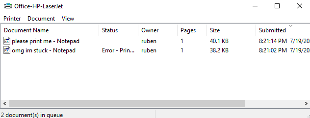
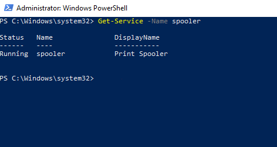
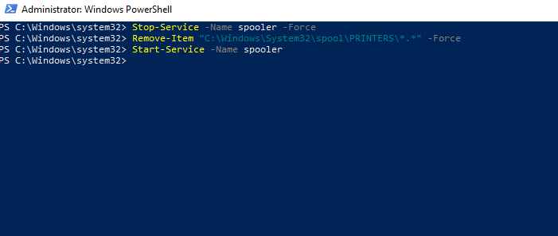
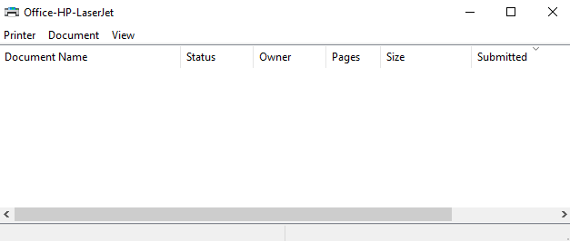

# Case #001 — Printer Offline / Print Queue Stuck
 
- **Category:** Hardware
- **Simulated priority:** Low
- **Resolution time:** ~10 min
 
**Note:** This scenario was reproduced in a controlled VMware Workstation environment for demonstration and practice purposes.
 
## 📌 Context
A user reports that a document sent to print remains stuck in the print queue and never completes. Attempting to send new print jobs — even to a different printer — also fails, suggesting the entire print system is affected, not just one job.
 
## 🔍 Observed Symptoms
- Document shows "Printing" or "Spooling" in the queue, but never finishes
- "Cancel All Documents" does not remove the stuck job (or takes an unusually long time)
- New print jobs sent afterwards also fail to print

## 🧠 Diagnosis
1. Open the print queue (`Devices and Printers` → double-click the printer) — confirm the job is genuinely stuck, not just slow
2. Attempt to cancel the job via the GUI (`Printer` menu → `Cancel All Documents`)
3. `Get-Service -Name spooler` — confirm the Print Spooler service is running, but the queue remains jammed regardless
4. Conclusion: leftover/corrupted spool files are stuck on disk, and the spooler service is holding a lock on them — a service restart combined with a manual cleanup of the spool folder is required

## 🛠️ Applied Solution
 
```powershell
Stop-Service -Name spooler -Force
Remove-Item "C:\Windows\System32\spool\PRINTERS\*.*" -Force
Start-Service -Name spooler
```
 
### 🔍 Command Breakdown

* **`Stop-Service -Name spooler -Force`**: stops the Print Spooler service, releasing the lock it holds on the queued spool files so they can be safely deleted.
* **`Remove-Item "...\PRINTERS\*.*" -Force`**: deletes the actual stuck print job files directly from disk — this succeeds even when the GUI's "Cancel" fails, because it doesn't depend on the spooler service being responsive.
* **`Start-Service -Name spooler`**: restarts the spooler with a clean, empty queue.

## ✅ Verification
- Print queue shows no pending jobs
- A new test print job completes successfully

## 📝 Lessons Learned
- A running Print Spooler service does not guarantee a healthy queue — corrupted spool files can jam the system even while the service itself reports as active
- Clearing the spool folder directly is often faster and more reliable than waiting on the GUI's "Cancel" function, especially when a job is unresponsive
- This should be one of the first checks for "nothing will print" tickets, since it resolves both single stuck jobs and global printing failures

## 🖼️ Evidence
**Before — stuck print job in queue:**

 
**Spooler service status check:**

 
**Applying the fix (stop, clear, restart):**

 
 **After — successful test print:**


---
 
**Tags:** `windows` `printing` `hardware` `troubleshooting`