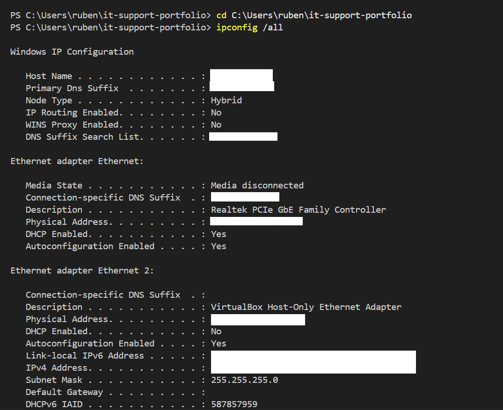
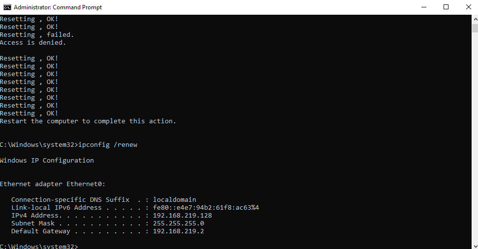
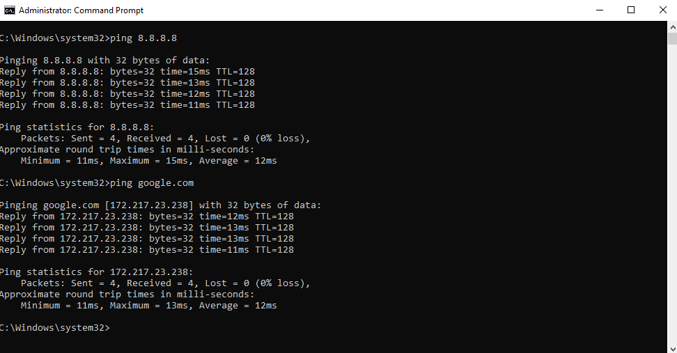

# Case #001 — Resolução de Problemas de Conectividade via Reset de Definições de Rede (Windows 10/11)

## 📌 Contexto
Um utilizador reporta que o computador mostra o Wi-Fi ligado, mas não consegue aceder a
sites nem à rede local. O problema surgiu após uma atualização do Windows.

## 🔍 Sintomas observados
- Ícone de Wi-Fi mostra "ligado", mas sem acesso à internet
- Não é possível fazer ping a `8.8.8.8` nem a `google.com`
- Outros dispositivos na mesma rede funcionam normalmente

## 🧠 Diagnóstico
1. Verificar se o problema é local ou de rede — testar noutro dispositivo
2. `ipconfig /all` — verificar se o adaptador tem IP válido e gateway correto
3. `ping 127.0.0.1` — testar a stack TCP/IP local
4. `ping <gateway>` — testar ligação ao router
5. Conclusão: configuração de rede local corrompida — necessário reset

## 🛠️ Solução aplicada
```powershell
ipconfig /release
ipconfig /flushdns
netsh winsock reset
netsh int ip reset
ipconfig /renew
```
Reiniciar o computador após executar os comandos.

## ✅ Verificação
- `ping 8.8.8.8` — sucesso
- `ping google.com` — sucesso
- Browser abre páginas normalmente

## 📝 Lições aprendidas
- O reset de Winsock e da stack IP resolve grande parte dos problemas de conectividade
- Deve ser um dos últimos passos do diagnóstico, depois de confirmar cabos e drivers

## 🖼️ Evidências





---
**Tags:** `windows` `networking` `tcp-ip` `troubleshooting`