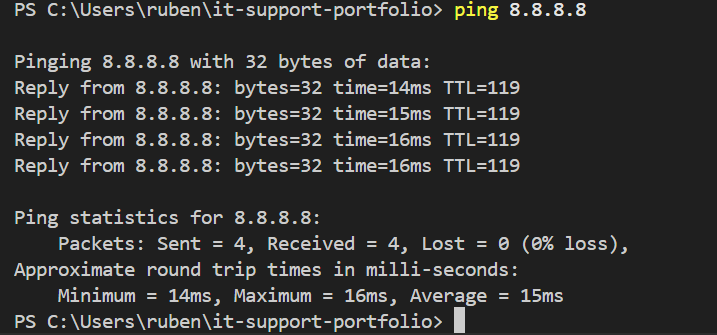
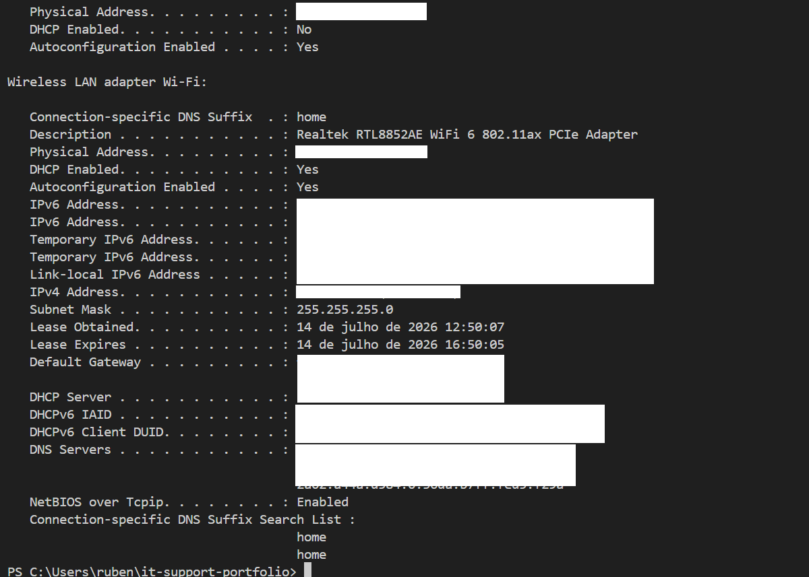

# Case #001 — Troubleshooting Connectivity Issues by Resetting Network Settings (Windows 10/11)

**Note:** This scenario was reproduced in a controlled VirtualBox VM environment for demonstration and practice purposes.

## 📌 Context
A user reports that the computer shows an active network connection, but cannot access websites or the local network. Investigation revealed an incorrect manual IP configuration (wrong default gateway), which was preventing outbound traffic.

## 🔍 Observed Symptoms
- Wi-Fi icon shows "connected", but there is no internet access
- Unable to ping `8.8.8.8` or `google.com`
- Other devices on the same network work normally

## 🧠 Diagnosis
1. Verify whether the issue is local or network-related — test using another device
2. `ipconfig /all` — check if the network adapter has a valid IP address and correct gateway
3. `ping 127.0.0.1` — test the local TCP/IP stack
4. `ping <gateway>` — test the connection to the router
5. Conclusion: local network configuration was corrupted — a reset was required

## 🛠️ Applied Solution

```powershell
ipconfig /release
ipconfig /flushdns
netsh winsock reset
netsh int ip reset
ipconfig /renew
```

Restart the computer after running the commands.

### 🔍 Command Breakdown

* **`ipconfig /release`**: Releases the current IP address from the network adapter, temporarily dropping the local IP assignment.
* **`ipconfig /flushdns`**: Clears the local DNS resolver cache, forcing Windows to request fresh, up-to-date IP addresses for websites.
* **`netsh winsock reset`**: Resets the Winsock catalog (the API handling network program requests), repairing connection bugs caused by third-party software or VPNs.
* **`netsh int ip reset`**: Reinstalls/resets the TCP/IP protocol stack within the Windows Registry to clear corrupted configurations.
* **`ipconfig /renew`**: Requests a brand-new IP address from the DHCP server (router), restoring internet access.

## ✅ Verification
- `ping 8.8.8.8` — successful
- `ping google.com` — successful
- Browser opens websites normally

### ⚠️ Observation during execution
During the execution of `netsh int ip reset`, one specific entry failed with
"Access is denied", even when running the terminal in elevated (Administrator) mode.
This is a known Windows behavior, related to restricted permissions on a specific
registry key (`HKLM\SYSTEM\CurrentControlSet\Control\Nsi`) that cannot be modified
solely with standard administrator privileges. The reset of the remaining components
completed successfully and did not prevent the resolution of the connectivity issue.

## 📝 Lessons Learned
- Resetting Winsock and the IP stack can resolve many connectivity issues
- It should be one of the final troubleshooting steps, after confirming cables, hardware, and drivers are working correctly

## 🖼️ Evidence
**Normal situation; ping successfull:**

**Ipconfig showing correct configuration:**
 | 
**Before - Misconfigured gateway; ping fails:**

**Applying the reset commands:**

**After - Successfull ping, issue resolved:**


---

**Tags:** `windows` `networking` `tcp-ip` `troubleshooting`