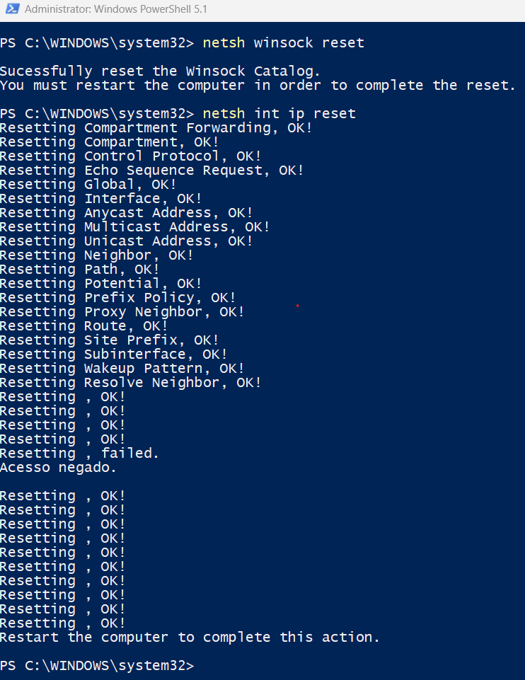

# Case #001 — Troubleshooting Connectivity Issues by Resetting Network Settings (Windows 10/11)

## 📌 Context
A user reports that the computer shows the Wi-Fi connection as active, but they cannot access websites or the local network. The issue started after a Windows update.

## 🔍 Observed Symptoms
- Wi-Fi icon shows "connected", but there is no internet access
- Unable to ping `8.8.8.8` or `google.com`
- Other devices on the same network work normally

## 🧠 Diagnosis
1. Verify whether the issue is local or network-related — test using another device
2. `ipconfig /all` — check if the network adapter has a valid IP address and correct gateway
3. `ping 127.0.0.1` — test the local TCP/IP stack
4. `ping <gateway>` — test the connection to the router
5. Conclusion: local network configuration was corrupted — a reset was required

## 🛠️ Applied Solution

```powershell
ipconfig /release
ipconfig /flushdns
netsh winsock reset
netsh int ip reset
ipconfig /renew
```

Restart the computer after running the commands.

## ✅ Verification
- `ping 8.8.8.8` — successful
- `ping google.com` — successful
- Browser opens websites normally

### ⚠️ Observation during execution
During the execution of `netsh int ip reset`, one specific entry failed with
"Access is denied", even when running the terminal in elevated (Administrator) mode.
This is a known Windows behavior, related to restricted permissions on a specific
registry key (`HKLM\SYSTEM\CurrentControlSet\Control\Nsi`) that cannot be modified
solely with standard administrator privileges. The reset of the remaining components
completed successfully and did not prevent the resolution of the connectivity issue.

## 📝 Lessons Learned
- Resetting Winsock and the IP stack can resolve many connectivity issues
- It should be one of the final troubleshooting steps, after confirming cables, hardware, and drivers are working correctly

## 🖼️ Evidence
 | (../screenshots/001-reset-network-settings/02-ipconfig-before.png)





---

**Tags:** `windows` `networking` `tcp-ip` `troubleshooting`